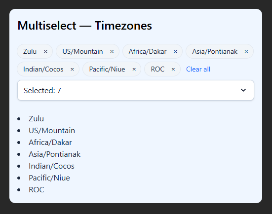

# 📋 Multiselect Component

This project implements a reusable React Multiselect dropdown component that allows users to select multiple options from a dynamic list. The component is built with React, Vite, and styled using TailwindCSS for a clean and intuitive user interface.

***

## 👁🗨 Preview



***

## ✨ Features

- Select multiple options from a dropdown list.
- Search/filter options within the dropdown.
- Display selected options prominently.
- Clear individual or all selected options with a click.
- Handles empty options array gracefully.
- Scrollable dropdown to handle large option lists.
- Uses live timezone data fetched from [TimeAPI](https://timeapi.io/api/timezone/availabletimezones).

***

## 🛠 Technologies Used

- React for building UI components
- Vite for fast development and build tooling
- TailwindCSS for styling

***

## 🚀 Live Demo

Check out the deployed version of this app here:  
[Multiselect Component Live Demo](https://vitali007tut.github.io/multiselect/)

***

## 📦 Getting Started (Local Setup)

Follow these steps to run the project locally on your machine:

1. Clone the repository  
```
git clone https://github.com/vitali007tut/multiselect.git
```

2. Navigate into the project directory  
```
cd multiselect
```

3. Install dependencies  
```
npm install
```

4. Start the development server  
```
npm run dev
```

5. Open your browser and go to the address shown in the terminal
